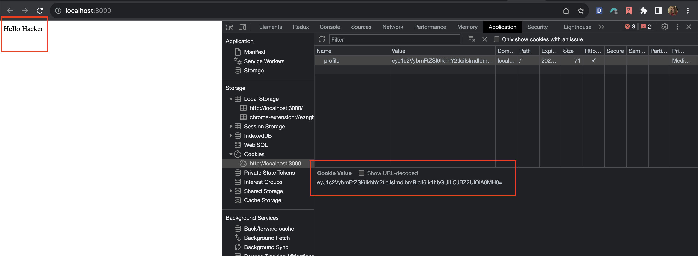

# Insecure Deserialization in Node.js

- This note is inspired by [snyk blog](https://snyk.io/blog/preventing-insecure-deserialization-node-js/)

- [node-serialize](https://snyk.io/advisor/npm-package/node-serialize) and [serialize-to-js](https://snyk.io/advisor/npm-package/serialize-to-js) are Node.js and JavaScript packages that are vulnerable to insecure deserialization. Unlike `JSON.parse` and `JSON.stringify`, which only serialize objects in JSON format, these two libraries serialize objects of almost any kind, including functions. This characteristic makes them vulnerable to [prototype pollution](https://learn.snyk.io/lesson/prototype-pollution/), an injection attack where a malicious actor gains control of the default values of an object’s properties.

- This implementation will demonstrate how to patch deserialization vulnerabilities in Node.js

# Analysis

- First, checkout the `server.js` file, we have the following code
- In this case, we've used a `unserialize` function from an vulnerable package which is called `node-serialize`. Besides that, we've also passed a `untrusted` input to that function.

```JS
app.get('/', (req, res) => {
  // If already had cookies
  if (req.cookies.profile) {
    // Get the cookie value
    let cookie = new Buffer(req.cookies.profile, 'base64').toString();

    // unserialize the cookie
    const data = serialize.unserialize(cookie);

    // If has username field in the extracted cookie
    // Then send the response to the client the username as an output
    if (data.username) {
      res.send(`Hello ${escape(data.username)}`);
    }
  } else {
    // Assign a cookie for client if has no cookies yet
    res.cookie(
      'profile',
      'eyJ1c2VybmFtZSI6IkpvaG4iLCJnZW5kZXIiOiJNYWxlIiwiQWdlIjogMzV9',
      { maxAge: 900000, httpOnly: true }
    );
  }

  res.send('Welcome to the Unsecured  Serialize-Deserialize Demo!');
});
```

# PoC

- Following these steps to proof the bug
- We can see a token which returns to the client. Let's take a look on it
- Extract the token, we have the following information

```JSON
{"username":"John","gender":"Male","Age": 35}
```

- What if we change value of a random key and encode it again with `Base64`. In this case, I changed the `username` key from `John` to `Hacker`

```JSON
{"username":"Hacker","gender":"Male","Age": 40}
```

- After encoding above object, I've got new `base64` token

```JSON
eyJ1c2VybmFtZSI6IkhhY2tlciIsImdlbmRlciI6Ik1hbGUiLCJBZ2UiOiA0MH0=
```

- Now, replace the current cookie in the browser with the new encoded value and change the HTTP response in the `server.js` and restart the server to see the result



- Let's exploit the vulnerability to perform an arbitrary code execution (ACE), which passes `untrusted data` to the `unserialize()` function

- First, we're going to create a sample payload. Run the `serialize.js` file to get the payload

```JS
// Output from serialize.js file
{"myOutput":"_$$ND_FUNC$$_function () {\n    return 'You are hacked';\n  }"}

// Create a new payload to pass into `unserialize` function
const payload = {
  username: "_$$ND_FUNC$$_function () {\n    return 'You are hacked';\n  }()",
  gender: 'Male',
  Age: 40,
};
```

- Run the app `npm start` and go to the path `/poc` to see the how the data is changed. The application will return a new response which contains the untrusted data. The serialization process was successfully exploited! As attackers who control the input of the client-side object, we were able to manipulate it to include JavaScript code that changes the username field.

```JSON
Hello You are hacked
```

# How To Fix

- So, how to fix this. The best way to prevent this vulnerability is to avoid deserializing user inputs completely. The second best way is to check the user input before serialize it. To do that, we can use [serialize-javascript](https://www.npmjs.com/package/serialize-javascript) package to sanitize the inputs

- In this case, we'll use `serialize-javascript` package to sanitize the input
- After sanitizing the input, the function has been removed, hence we can filter the untrusted data which passed to our application

```JS
// Implement safe serialization
import serialize from 'serialize-javascript';

const input = {
  myOutput: function () {
    return 'You are hacked';
  },
};

// Sanitize the inputs by removing the function
// The `ignoreFunction` ensures that the functions used to execute ACE are not serialized
const serializedInput = serialize(input, {
  ignoreFunction: true,
});

const sanitizedPayload = {
  // Leverage the JavaScript IIFE to the call function
  username: serializedInput,
  gender: 'Male',
  Age: 40,
};

// Then we can see the function is removed from the input
console.log('Serialized Input: \n' + serializedInput + '\n');
console.log(sanitizedPayload);
// Output
Serialized:
{}
```
